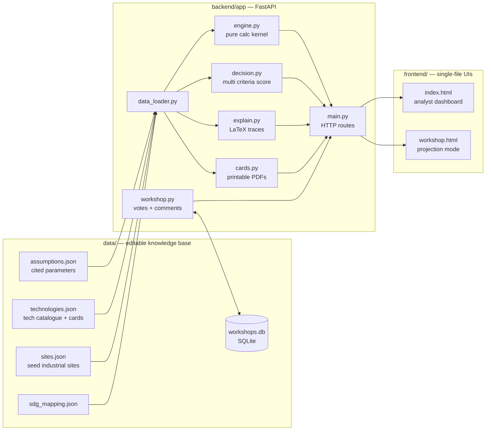

# Laidlaw: Industrial Decarbonisation Pathway Comparator (IDPC)

[](https://github.com/defnalk/laidlaw/actions/workflows/ci.yml)

Decision-support tool for the Laidlaw Scholars research project
**"Carbon Capture vs. Electrification: Which Wins for Industry?"**

Compares CCS retrofits vs. full electrification for hard to abate sectors
(steel, cement, chemicals) on **cost, abatement, jobs, air quality,
infrastructure readiness, and timeline**. Designed to support the
*Industrial Transitions, Human Stories* Leadership in Action project,
giving students, residents, and workers a structured voice in
decarbonisation decisions through participatory workshops.

---

## Why this exists

> *"Should this steelworks retrofit with carbon capture, or switch entirely
> to electric arc furnaces and green hydrogen?"*

Most decarbonisation tools answer that question with a single number from a
black box model. This one is built around three commitments:

1. **Every number is traceable.** No cost, penalty, or weight is hardcoded
   in Python: they all live in `data/assumptions.json` with a citation
   field. The `/explain` endpoint returns LaTeX rendered calculation traces.
2. **The tool is data driven, not code driven.** Add a new sector, capture
   technology, or pathway card by editing JSON. The engine discovers it.
3. **It is decision *support*, not a decision *maker*.** Every result ships
   with caveats listing what the model does NOT capture (political
   feasibility, social acceptance, supply chain risk).

---

## Architecture



The engine is a **pure calculation kernel**: it reads parameters from
`data_loader`, performs DCF / mass balance / scoring maths, and returns
plain dataclasses. Every other module sits above it.

---

## URLs

| Route                       | Purpose                                            |
|-----------------------------|----------------------------------------------------|
| `/ui/`                      | Analyst dashboard (Plotly + KaTeX traces + tornado) |
| `/ui/workshop.html`         | Workshop mode, projection friendly live voting + comments |
| `/cards/{site_id}`          | Printable A5 pathway cards (Print → Save as PDF)   |
| `/compare/{site_id}`        | POST: full side by side comparison + recommendation |
| `/explain/{site_id}`        | POST: step by step LaTeX calculation trace        |
| `/sensitivity/{site_id}`    | GET: sweep one parameter, return cost curves      |
| `/tornado/{site_id}`        | GET: rank parameters by their cost swing leverage |
| `/workshop/{code}`          | GET: live tally + comments (SQLite-backed)        |
| `/assumptions`              | GET: full knowledge base with citations           |
| `/reload`                   | POST: hot reload JSON without restart             |
| `/docs`                     | FastAPI auto generated API docs                   |

---

## Run

```bash
# With Docker (recommended)
docker compose up
# → http://localhost:8000/ui/

# Or locally
cd backend
python -m venv .venv && source .venv/bin/activate
pip install -r requirements.txt
uvicorn app.main:app --reload
pytest -q                              # 14 tests
```

---

## Adding new knowledge (no code changes needed)

| You want to…                              | Edit this file              |
|-------------------------------------------|-----------------------------|
| Add a new industrial site                 | `data/sites.json`           |
| Add a new capture or electrification tech | `data/technologies.json` (the `card` block automatically appears in the printable PDFs) |
| Update an IEA / IEAGHG cost benchmark     | `data/assumptions.json`     |
| Reweight the decision algorithm          | `data/assumptions.json` → `decision_weights` |
| Tag a metric to a different SDG           | `data/sdg_mapping.json`     |

Then `POST /reload` (or use the **Reload assumptions** button in the
dashboard) to pick up changes without a restart. This means **workshop
participants can reweight the decision criteria live**, see the
recommendation flip in real time, and discuss why.

---

## The decision algorithm

`backend/app/decision.py` implements a transparent weighted multi criteria score:

```
score(pathway) = Σᵢ wᵢ · normalise(metricᵢ)
```

Weights live in `data/assumptions.json` under `decision_weights`:

```json
"decision_weights": {
  "cost_per_tco2":            0.30,
  "abatement_percentage":     0.25,
  "air_quality_score":        0.15,
  "jobs_net_score":           0.10,
  "infrastructure_readiness": 0.10,
  "implementation_speed":     0.10
}
```

This is the extension point for richer algorithms (AHP, TOPSIS, or a learned
ranker over workshop voting data). The function signature is stable; swap
the body and the rest of the system keeps working.

---

## Caveats: what this tool does NOT capture

- Political feasibility & permitting risk
- Social acceptance beyond a jobs proxy
- Supply chain and geopolitical risk for critical minerals / hydrogen
- Behavioural change and demand side measures
- Plant specific engineering constraints

These limitations are surfaced in every `/compare` response and on the
dashboard. **Always present results alongside these caveats in workshops.**

---

## Project context

Built for the Laidlaw Scholars Leadership and Research Programme at
Imperial College London. The research project investigates whether
hard to abate sectors should retrofit existing plants with CCS or switch
entirely to clean electricity, evaluating cost per tonne of CO₂ avoided,
infrastructure changes, and social impacts including air quality and jobs.
Outputs serve **SDGs 7, 9, 12, and 13**.

The Leadership in Action project, *Industrial Transitions, Human Stories*,
uses this tool's Workshop Mode and printed Pathway Cards to give students,
local residents, and workers a structured voice in decarbonisation debates.

---

## Roadmap / Status

| Area | Status | Notes |
|---|---|---|
| Calculation engine (CCS + electrification) | **Stable** — `v0.4` | All numerical assumptions live in `data/assumptions.json` with citations. |
| Heat-pump COP table | **Stable** — `v0.4` | Per-technology COP from IEA *Future of Heat Pumps* 2022. |
| H₂ pipeline proximity | **Stable** — `v0.4` | Country-indexed against the European Hydrogen Backbone 2023 plan. |
| Decision algorithm + narrative | **Stable** — `v0.3` | Weights in `assumptions.json`, fully data-driven. |
| FastAPI backend | **Stable** — `v0.2` | Compare / explain / workshop endpoints, full TestClient coverage. |
| Docker + CI | **Stable** — `v0.4` | Multi-stage build, ruff + mypy + pytest matrix, Docker build job. |
| Static frontend | **MVP** — `v0.2` | Two static HTML pages; an SPA refresh is on the v0.5 list. |
| Strict typing across `main.py` | **Planned** — `v0.5` | Engine + models already strict; FastAPI surface is the next pass. |
| Sensitivity analysis (Monte Carlo over assumption bounds) | **Planned** — `v0.5` | Uses the `low` / `central` / `high` triples already in CCS CAPEX. |
| Real GIS-based H₂ + CO₂ proximity | **Planned** — `v0.6` | Replace the country index with EHB / CCUS-network shapefiles. |
| Per-pathway emission factors per region | **Planned** — `v0.6` | Hourly grid CO₂ intensity instead of annual averages. |

See [`CHANGELOG.md`](CHANGELOG.md) for the full release history.

---

## License

MIT, see [LICENSE](LICENSE).
